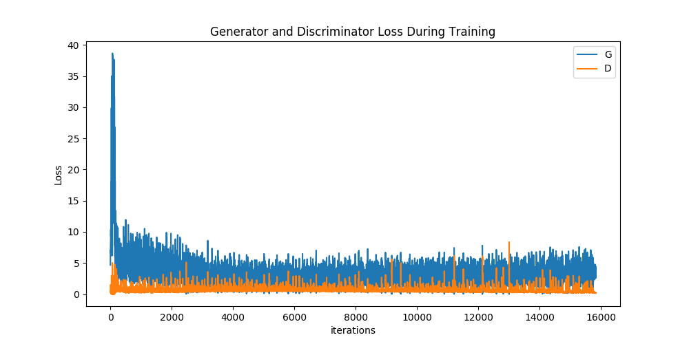
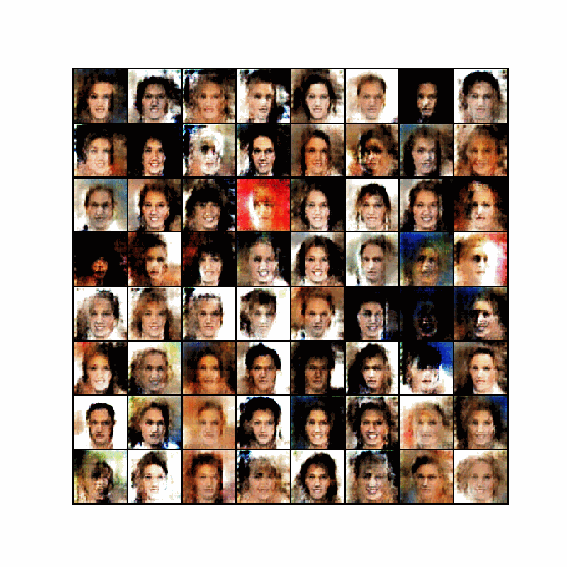
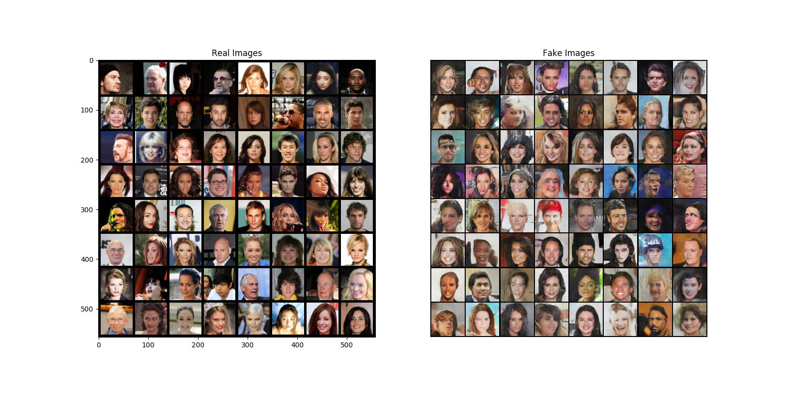

# DCGAN with Pytorch
It is an reimplement of [DCGAN](https://arxiv.org/abs/1511.06434) with pytorch.

## Install
Step 0: **Download**
```angular2
git clone https://github.com/zhoulukuan/DCGAN-Pytorch
```

Step 1: **Install Pytorch and other package**
```
pip install -r requirements
```

Step 2: **Dataset preparation**
We use [Celeb-A Faces dataset](http://mmlab.ie.cuhk.edu.hk/projects/CelebA.html) dataset. Download `img_align_celeba.zip` and the resulting directory
structure should be:
```angular2
/path/to/img
    -> img_align_celeba
        -> XXXXXX.jpg
        -> XXXXXX.jpg
```

## Usage
Train your model by running:
```angular2
python train.py configs/dcgan.py --save_dir /path/to/save --images_dir /path/to/img 
```
Results will be saved in `save_dir` including models of G/D and some results for visualization.

## Results
Use setting in `configs/dcgan.py`(lr=0.0002,bs=128,epochs=10,Adam optimizer).




## Reference
- [Pytorch Tutorial](https://pytorch.org/tutorials/beginner/dcgan_faces_tutorial.html?highlight=dcgan)
- [togheppi/DCGAN](https://github.com/togheppi/DCGAN)